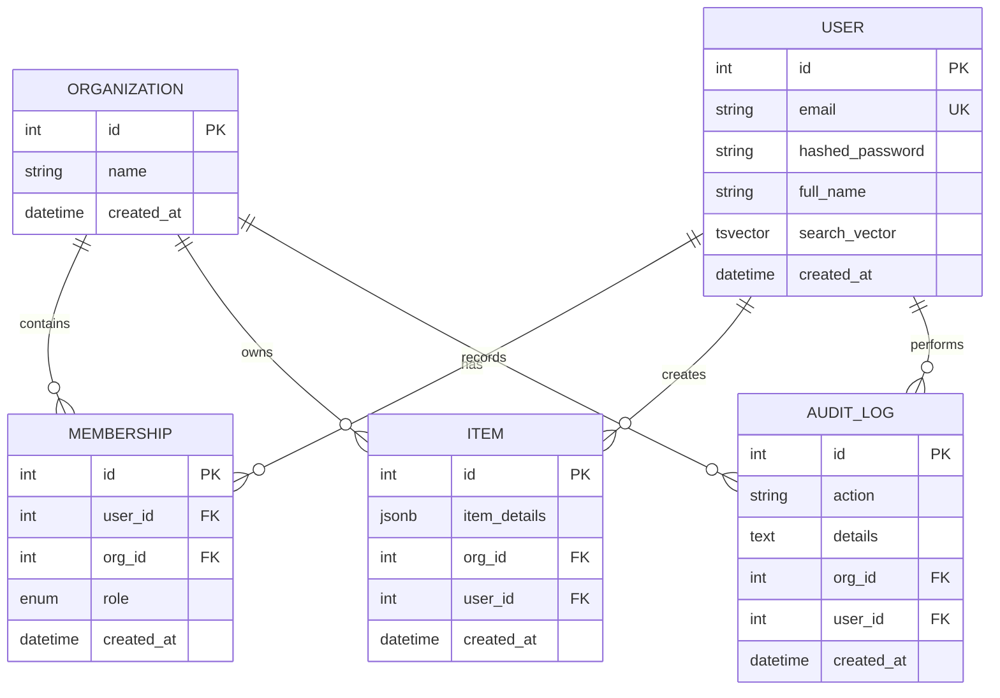

# Organization Manager App

This is my backend project  
I use Python and FastAPI

## Database Design

The system uses a relational schema optimized for multi-tenancy and high-performance search.




## What the app can do
- Users can sign up and log in (with JWT)
- Create organizations
- Invite people (Admin or Member)
- Add items (only see your items if Member)
- Admin see all items
- Search users fast (with Postgres full-text)
- See activity logs
- Ask AI questions about logs (use Google Gemini)

## Technologies I use
- Python 3.11+
- FastAPI
- SQLAlchemy 2.0 (async)
- PostgreSQL
- JWT authentication
- RBAC authorization
- Pytest 

## AI Chatbot 

The AI part uses Google Gemini

How to use real AI:
1. Go → https://aistudio.google.com/app/apikey
2. Make new key (free)
3. Copy .env
4. Write your key: GEMINI_API_KEY=AIz...
5. Run docker compose up --build

## How to start the app

You need Docker on your laptop or computer

1. Run this command:
```bash
docker compose up --build